## Welcome! 👋

I am a curious data scientist passionate about extracting insights from data and using theoretical ML in real concrete projects in intuitive webapps. This portfolio showcases my work, skills, and journey as I seek new opportunities.

## 🚀 About Me

**Name:** Tom Salembien

**Profession:** Data Scientist in Richemont Switzerland

Curious, analytical, and always eager to learn.

## 🌐 Live Portfolio

[Visit My Portfolio](https://tomsohm.github.io/devportfolio/)

## Tech Stack

### Technical Expertise

| Subject | Tools/Key Technologies |
|:-------------------------------------------|:--------------------------------------------------------|
| **Programmation** | Python, Java, CSS, HTML, SQL, SAS, PHP, JavaScript, Bash Linux|
| **Machine Learning** | Scikit-Learn, Pandas, TensorFlow, PyTorch, Lightning, FlashAttention|
| **Deployment** | Streamlit, Dash, FastAPI, CSS+HTML, Git, Github(JS, React, Next.js)|
| **Data Engineering** | Apache Spark, Hadoop, Kafka|
| **Cloud & MLOps** | AWS, GCP|
| **Statistiques** | Python (SciPy, Statsmodels), Excel |
| **Visualisation** | Streamlit, Matplotlib, Seaborn, Plotly, Dash, PyGWalker, Power BI|

### Cross-Functional and Strategic Skills

- **Data wrangling & EDA**: Cleaning, preparation, exploratory data analysis (Pandas, NumPy, visualization tools like Matplotlib, Seaborn, Plotly).

- **Visualization and communication**: Ability to present results clearly, storytelling with python visualisation tools.

- **Interdisciplinary collaboration**: Teamwork with data engineers and researchers, business stakeholders, IT, marketing, etc.

- **Critical thinking and ethics**: Evaluation of data quality, bias management, respect for confidentiality and regulatory issues (GDPR, anonymization).

- **Adaptability and technology watch**: Ability to quickly learn new tools and adapt to the rapid evolution of the field.

## ✨ Features

- **Responsive Web Design**: Built with simple HTML, CSS, and JavaScript for a clean, accessible experience.
- **Data Science Projects**: Real-world examples in machine learning, data visualization, and analytics.
- **Interactive Elements**: JavaScript-powered UI for smooth navigation.
- **Optimized for Recruiters**: Quick access to my resume, LinkedIn, and project demos.

**Do not hesitate to contact me for any question or opportunity!**
